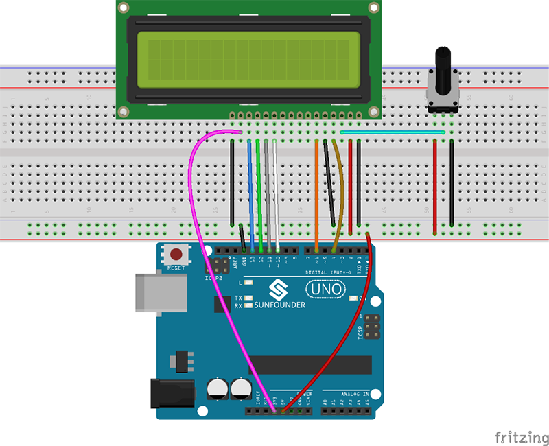

# LCD1602 Liquid Display

Class for interaction with a LCD Liquid Display based on LiquidCrystal class.
Generally speaking, LCD1602 has parallel ports, that is, it needs to control several pins at the same time. LCD1602 can be categorized into an eight-port connection and four-port connection. If the eight-port connection is used, then the digital ports of the board are basically completely occupied. If you want to connect more sensors, there will be no ports available. Therefore, we will use the four-port connection.

Introduction to the pins of LCD1602:
VSS: A pin that connects to ground
VDD: A pin that connects to a +5V power supply
VO: A pin that adjust the contrast of LCD1602
RS: A register select pin that controls where in the LCD‟s memory you are writing data to. You can select either the data register, which holds what goes on the screen, or an instruction register, which is where the LCD‟s controller looks for instructions on what to do next.
R/W: A Read/Write pin that selects reading mode or writing mode
E: An enabling pin that, when supplied with low-level energy, causes the LDC module to
execute relevant instructions.
D0-D7：Pins that read and write data.
A and K: Pins that control the LED backlight.

The connection diagram is shown here: .
